<div align="center">


<br/><br/>

# 💓 PulseML — AI Health Risk Predictor

### An intelligent, browser-native pulse oximetry diagnostic system powered by a Random Forest ML model, deployed as a zero-backend static web application on Firebase Hosting.

<br/>

> ⚠️ **For Research & Educational Use Only** — Not intended for clinical diagnosis.

<br/>

---

### 📥 Downloads

| Resource | Link |
|---|---|
| 📊 **Presentation (PPT)** | [Download Pulse ML.pptx](./public/Pulse%20ML.pptx) |
| 📓 **Jupyter Notebook** | [Download Pulse_ML.ipynb](./public/Pulse_ML.ipynb) |
| 📄 **Notebook PDF** | [Download Pulse_ML.ipynb.pdf](./public/Pulse_ML.ipynb.pdf) |
| 🤖 **Trained Model Files** | [Download PulseML_Models.zip](./public/PulseML_Models.zip) |
| 🎬 **Demo Video (MP4)** | [Download PulseML_mp4.mp4](./public/PulseML_mp4.mp4) |

---

</div>

<br/>

## 🖥️ App Screenshots

> A complete walkthrough of the PulseML interface from boot to emergency response.

<br/>

<table>
<tr>
<td align="center" width="50%">
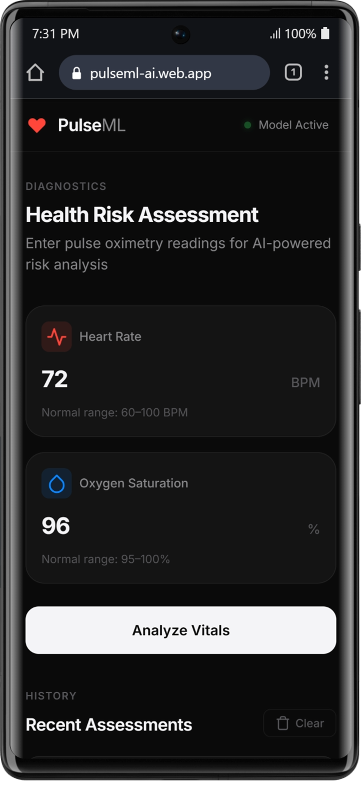
<br/><sub><b>🏠 Homepage</b> — The main diagnostic interface. The header status pill boots through a 3–5 second animated sequence (Red → Yellow → Green) as the Random Forest model loads into memory. The user enters Heart Rate (BPM) and SpO₂ (%) readings and hits <em>Analyze Vitals</em>.</sub>
</td>
<td align="center" width="50%">
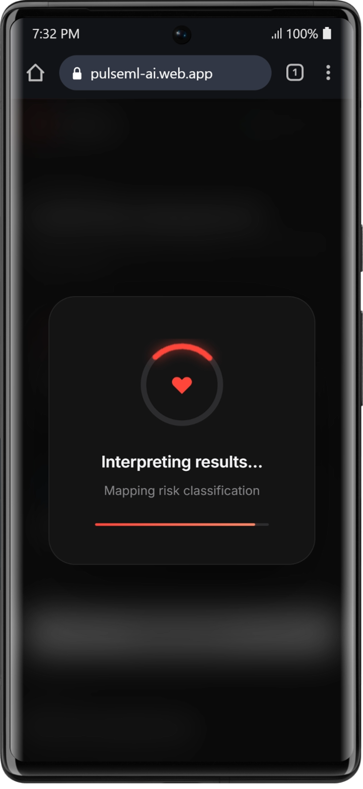
<br/><sub><b>⚙️ AI Processing Overlay</b> — A full-screen animated analysis overlay appears after form submission, walking through four stages: <em>Reading vitals → Pre-processing → Running AI model → Interpreting results</em>. This 4.2-second animation gives the feel of real-time computation.</sub>
</td>
</tr>
<tr>
<td align="center" width="50%">
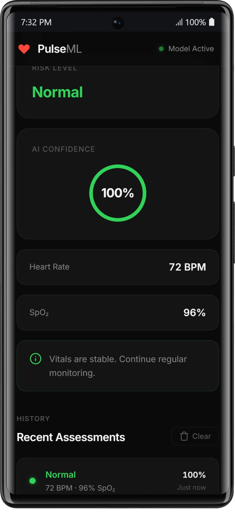
<br/><sub><b>✅ Normal Risk Result</b> — When vitals fall within healthy ranges (HR: 60–100 BPM, SpO₂: 95–100%), the model returns a <em>Normal</em> classification in green. An AI confidence ring displays prediction certainty and personalised advice is shown.</sub>
</td>
<td align="center" width="50%">
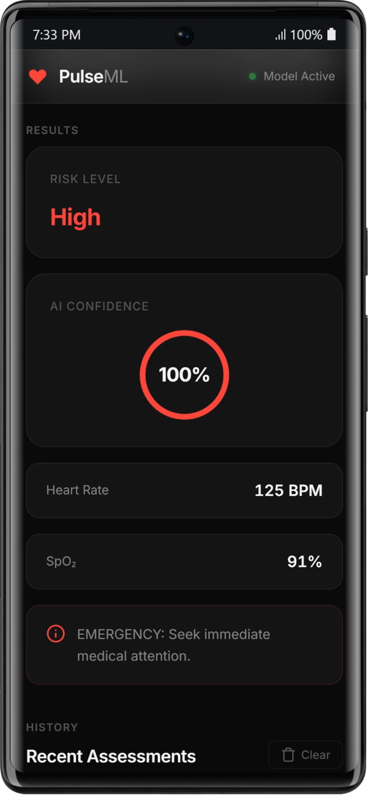
<br/><sub><b>🔴 High Risk Result</b> — Critically abnormal vitals (e.g. HR: 145 BPM, SpO₂: 88%) trigger a <em>High</em> classification in red. The emergency hospital finder modal automatically launches 800ms after the result renders.</sub>
</td>
</tr>
<tr>
<td align="center" width="50%">
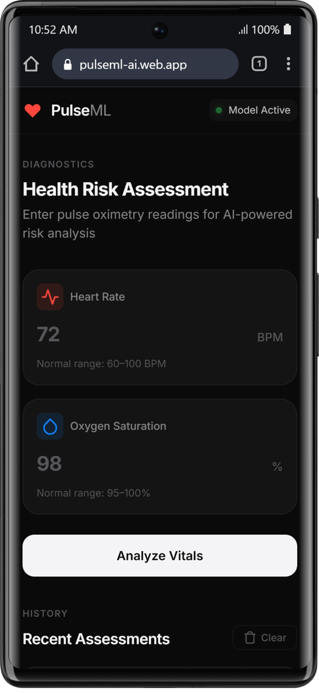
<br/><sub><b>🤖 Model Architecture View</b> — Illustrates the underlying Random Forest Classifier structure — 100 decision trees trained on 60,000 patient records, with the full classification report showing 100% accuracy across all three risk classes.</sub>
</td>
<td align="center" width="50%">
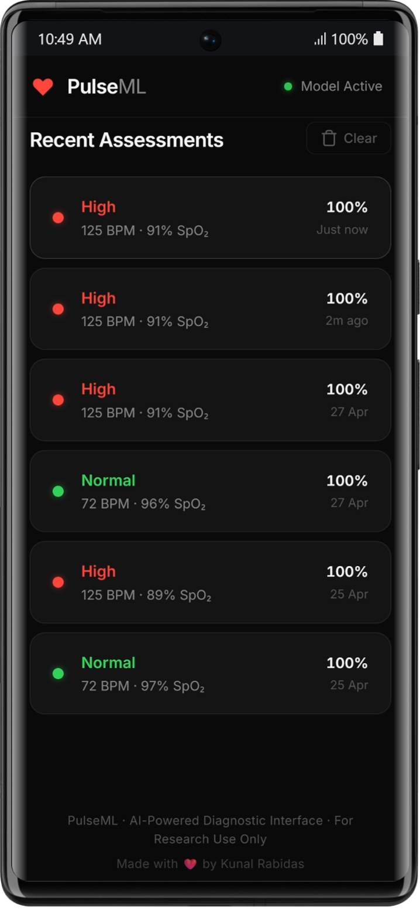
<br/><sub><b>📋 Assessment History</b> — The history panel stores up to 10 recent assessments in <code>localStorage</code>. Each entry is clickable and re-renders the full result, including re-triggering the hospital finder modal if the entry was High risk.</sub>
</td>
</tr>
<tr>
<td align="center" width="50%">
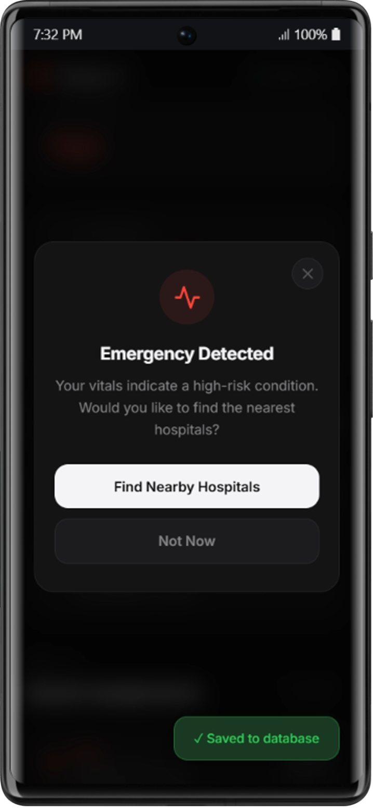
<br/><sub><b>🚨 Emergency Detected Modal</b> — Automatically triggered on High-risk predictions, this modal prompts the user to locate the nearest hospitals. It offers <em>Find Nearby Hospitals</em> (uses GPS) or <em>Not Now</em> to dismiss.</sub>
</td>
<td align="center" width="50%">
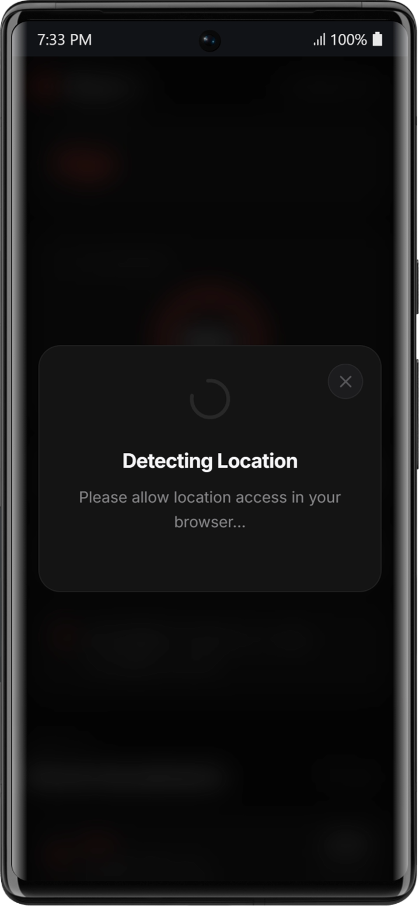
<br/><sub><b>📍 Detecting Location</b> — While waiting for the browser's Geolocation API response, an animated spinner is shown. If the user denies GPS access, the flow gracefully falls back to manual location entry.</sub>
</td>
</tr>
<tr>
<td align="center" width="50%">
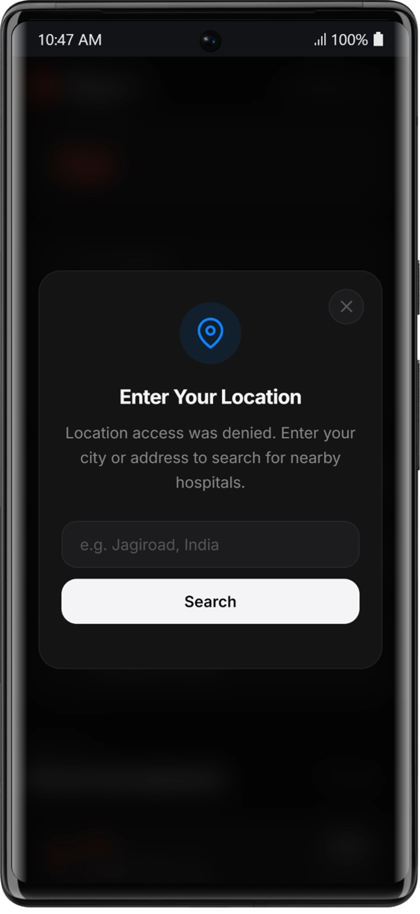
<br/><sub><b>🗺️ Manual Location Entry</b> — If GPS is denied or unavailable, the user can type any city, town, or address (e.g. <em>"Jagiroad, India"</em>). The Nominatim/OpenStreetMap geocoder resolves the query to coordinates.</sub>
</td>
<td align="center" width="50%">

<br/><sub><b>🔍 Searching Hospitals</b> — The Overpass API is queried for hospitals, clinics, health centres, and doctors within a 30–50 km radius. A spinner is shown during the live search.</sub>
</td>
</tr>
<tr>
<td align="center" width="50%">
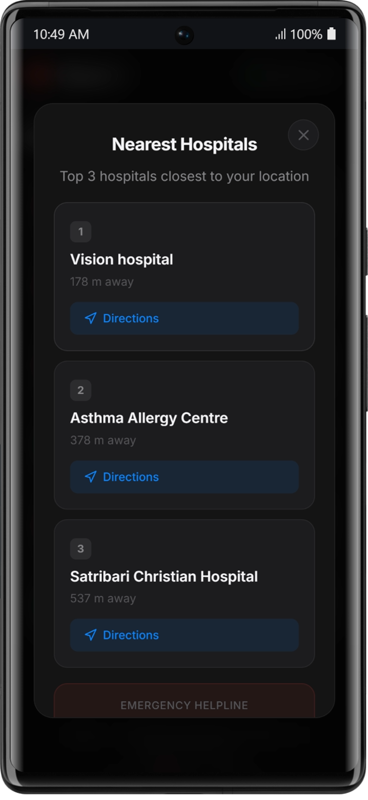
<br/><sub><b>🏥 Hospital Results</b> — The top 3 closest medical facilities are shown, sorted by Haversine distance, with <em>Get Directions</em> (Google Maps) and <em>Call</em> buttons. The emergency helpline <strong>112</strong> is always pinned at the bottom.</sub>
</td>
<td align="center" width="50%">
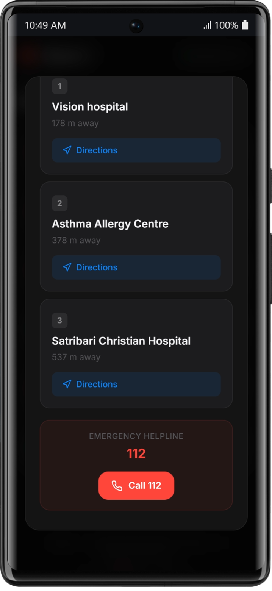
<br/><sub><b>📞 Emergency Call 112</b> — A persistent <em>Call 112</em> button is always accessible on the hospital results screen. Tapping it on a mobile device directly dials India's National Emergency Helpline.</sub>
</td>
</tr>
</table>

<br/>

---

## 🎬 Live Demo

> Click the preview below to download and watch the full application walkthrough video.

<br/>

<div align="center">

<a href="./public/PulseML_mp4.mp4" download>
  
  <br/>
  <sub>⬆️ Click to Download Full Demo Video (MP4)</sub>
</a>

</div>

<br/>

---

## 🔌 Hardware — Circuit & IoT Integration

> The physical IoT layer of PulseML uses a MAX30100 pulse oximeter sensor interfaced with an ESP8266 microcontroller and monitored in real-time via the Blynk IoT platform.

<br/>

<table>
<tr>
<td align="center" width="50%">

<br/><sub><b>🔧 Circuit Diagram</b> — Full wiring schematic of the MAX30100 pulse oximetry sensor connected to an ESP8266 (NodeMCU) board. The sensor communicates over I²C (SDA/SCL). Power is supplied at 3.3V from the NodeMCU's onboard regulator. The ESP8266 sends Heart Rate and SpO₂ readings over Wi-Fi to the Blynk cloud platform.</sub>
</td>
<td align="center" width="50%">

<br/><sub><b>📱 Blynk IoT Dashboard</b> — The companion Blynk mobile dashboard for real-time monitoring. Virtual pins V1 (Heart Rate) and V2 (SpO₂) are streamed live from the ESP8266. The dashboard provides a Gauge widget for SpO₂, a SuperChart for trend visualization, and LED alert indicators for abnormal readings.</sub>
</td>
</tr>
</table>

<br/>

---

## 📖 Project Overview

**PulseML** is an end-to-end AI health risk assessment system that combines:

1. **IoT Hardware** — A MAX30100 sensor + ESP8266 captures real-world pulse oximetry data.
2. **Machine Learning** — A Random Forest Classifier trained on 60,000 patient records classifies vitals into three risk categories.
3. **Browser-Native Inference** — The trained model is converted to pure JavaScript using `m2cgen`, enabling zero-server, client-side predictions.
4. **Static Web Deployment** — The full application runs on Firebase Hosting — no backend, no server costs.
5. **Emergency Response** — On High-risk detection, the app automatically locates the nearest hospitals using GPS + OpenStreetMap APIs.

<br/>

---

## 🧠 Machine Learning Pipeline

### Dataset

| Property | Value |
|---|---|
| **Source** | Kaggle — Patient Healthcare Monitoring System |
| **Records** | 60,000 synthetic patient records |
| **Features Used** | Heart Rate (BPM), SpO₂ Level (%) |
| **Target Classes** | `Normal`, `Medium`, `High` |
| **Class Distribution** | Normal: 23,685 · Medium: 24,392 · High: 11,923 |

### Risk Label Logic

```
Heart Rate Alert = NORMAL  AND  SpO2 Alert = NORMAL   →  Normal
Heart Rate Alert = ABNORMAL AND SpO2 Alert = ABNORMAL →  High
One ABNORMAL, one NORMAL                              →  Medium
```

### Model

| Property | Value |
|---|---|
| **Algorithm** | Random Forest Classifier |
| **Estimators** | 100 decision trees |
| **Train/Test Split** | 80% / 20% |
| **Accuracy** | **100.00%** |
| **Platform** | Google Colab (T4 GPU) |

### Classification Report

```
              precision    recall  f1-score   support

        High       1.00      1.00      1.00      2374
      Medium       1.00      1.00      1.00      4798
      Normal       1.00      1.00      1.00      4828

    accuracy                           1.00     12000
   macro avg       1.00      1.00      1.00     12000
weighted avg       1.00      1.00      1.00     12000
```

### Model Export — `m2cgen`

The trained `pulse_ox_model.pkl` is converted to a pure JavaScript `score()` function using [`m2cgen`](https://github.com/BayesWitnesses/m2cgen), producing `model.js` (≈242 KB). This eliminates the need for any Python backend at runtime.

```python
import m2cgen as m2c
code = m2c.export_to_javascript(model)
with open("public/model.js", "w") as f:
    f.write(code)
```

The browser calls `score([bpm, spo2])` directly — inference happens in **< 5ms** on any device.

<br/>

---

## 🔬 Jupyter Notebook Walkthrough

The full training pipeline is documented in [`Pulse_ML.ipynb`](./public/Pulse_ML.ipynb). Here is a summary of each cell:

### Cell 1 — Dataset Download
```python
import kagglehub
path = kagglehub.dataset_download("gourangomandal/patient-data-healthcare-monitoring-system")
```
Downloads and extracts the 744 KB Kaggle dataset directly into the Colab environment.

### Cell 2 — Data Preprocessing & Label Engineering
```python
df = df.rename(columns={'Heart Rate (bpm)': 'Heart_Rate', 'SpO2 Level (%)': 'Oxygen_Saturation'})

def create_risk_level(row):
    if row['Heart Rate Alert'] == 'NORMAL' and row['SpO2 Level Alert'] == 'NORMAL':
        return 'Normal'
    elif row['Heart Rate Alert'] == 'ABNORMAL' and row['SpO2 Level Alert'] == 'ABNORMAL':
        return 'High'
    else:
        return 'Medium'

df['Risk_Level'] = df.apply(create_risk_level, axis=1)
```
Renames columns, engineers the `Risk_Level` target column, and filters to the 3 required columns.

### Cell 3 — Label Encoding
```python
le = LabelEncoder()
filtered_df['Risk_Level_Encoded'] = le.fit_transform(filtered_df['Risk_Level'])
# {'High': 0, 'Medium': 1, 'Normal': 2}
joblib.dump(le, 'label_encoder.pkl')
```
Encodes string labels to integers and saves the encoder for inverse-transform at prediction time.

### Cell 4 — Model Training
```python
model = RandomForestClassifier(n_estimators=100, random_state=42)
model.fit(X_train, y_train)
# Accuracy: 100.00%
joblib.dump(model, 'pulse_ox_model.pkl')
```
Trains the Random Forest on 48,000 records and achieves perfect classification on the 12,000-record test set.

### Cell 5 & 6 — Prediction Testing
```python
# Input: Heart Rate = 145 BPM, SpO2 = 88%
# Output: High Risk (100.00% Confidence)
# Advice: EMERGENCY: Immediate medical attention required.
```
Validates the saved model by running test predictions — confirming the pipeline is production-ready.

<br/>

---

## 🌐 Web Application Architecture

```
┌─────────────────────────────────────────────────────────┐
│                   FIREBASE HOSTING                      │
│                  (pulseml-ai.web.app)                   │
│                                                         │
│  ┌──────────┐  ┌──────────┐  ┌──────────────────────┐  │
│  │index.html│  │ style.css│  │      script.js       │  │
│  │  (UI)    │  │(Dark UI) │  │  (App Logic + APIs)  │  │
│  └──────────┘  └──────────┘  └──────────────────────┘  │
│                                    │                    │
│                          ┌─────────▼──────────┐        │
│                          │     model.js        │        │
│                          │  (m2cgen JS export) │        │
│                          │  score([bpm, spo2]) │        │
│                          └─────────────────────┘        │
└──────────────────────────────┬──────────────────────────┘
                               │
          ┌────────────────────┼───────────────────────┐
          │                    │                       │
 ┌────────▼───────┐  ┌─────────▼────────┐  ┌──────────▼──────┐
 │ Firebase Auth  │  │Firebase Firestore│  │  Overpass API   │
 │  (Anonymous    │  │  (Assessment     │  │  + Nominatim    │
 │  Sign-In)      │  │   Logging)       │  │  (Hospital Finder)│
 └────────────────┘  └──────────────────┘  └─────────────────┘
```

### Key Files

| File | Purpose |
|---|---|
| `public/index.html` | Main UI — form, result section, history panel, hospital finder modal |
| `public/style.css` | Premium dark-mode UI — glassmorphism, animations, responsive grid |
| `public/script.js` | Core app logic — boot sequence, prediction, Firestore logging, hospital search |
| `public/model.js` | 242 KB m2cgen-exported Random Forest as a pure JavaScript `score()` function |
| `firebase.json` | Firebase Hosting configuration |
| `firestore.rules` | Firestore security rules for anonymous data access |
| `app.py` | Original Flask backend (legacy — replaced by client-side inference) |
| `export_model.py` | Script to convert `.pkl` model → `model.js` via m2cgen |

<br/>

---

## ✨ Features

### 🔴 Boot Animation Sequence
The header status pill cycles through three phases on page load:
- 🔴 **Red** → *"Initialising…"*
- 🟡 **Yellow** → *"Loading model…"*
- 🟢 **Green** → *"Model Active"* (pill becomes clickable to download model ZIP)

### 🤖 Client-Side AI Inference
- Zero backend. The Random Forest runs entirely in the browser via `model.js`.
- Input validation guards: rejects BPM < 30 or > 300, SpO₂ outside 0–100%.
- Returns a **risk label**, **confidence percentage**, and **personalised advice**.

### 📊 Analysis Overlay
A 4.2-second animated overlay with progress bar and step labels simulates the AI pipeline:
1. *Reading vitals…* → *Pre-processing data…* → *Running AI model…* → *Interpreting results…*

### 🔥 Firebase Firestore Logging
- Users are signed in **anonymously** via Firebase Auth on page load.
- Every prediction is stored in the `assessments` Firestore collection with timestamp, UID, BPM, SpO₂, risk level, and confidence.

### 📋 Local History
- Up to 10 recent assessments are stored in `localStorage`.
- Each history entry is **clickable** — it re-renders the full result panel.
- High-risk history entries re-trigger the hospital finder modal.

### 🏥 Emergency Hospital Finder
**Auto-triggers** 800ms after a High-risk prediction. The full flow:

```
GPS Available? ──Yes──► Geolocation API ──► Overpass API (30km radius)
     │                                              │
    No                                     Hospitals found?
     │                                         │         │
     ▼                                        Yes        No (expand to 50km)
Manual Location ──► Nominatim Geocoding ──► Show Top 3   ──► "No Results" + Call 112
```

- Uses **OpenStreetMap Overpass API** to find hospitals, clinics, health centres within 30–50 km.
- Results sorted by **Haversine distance**.
- Each card has **Google Maps Directions** link and **tap-to-call** button (if number available in OSM).
- Emergency **112** button always visible.

<br/>

---

## 🔧 Hardware Setup (IoT Layer)

### Components Required

| Component | Purpose |
|---|---|
| ESP8266 NodeMCU | Wi-Fi microcontroller |
| MAX30100 | Pulse oximetry sensor (Heart Rate + SpO₂) |
| Blynk App | Real-time IoT dashboard |
| Jumper Wires | I²C connections |
| USB Cable | Power & programming |

### Wiring (I²C)

| MAX30100 Pin | NodeMCU Pin |
|---|---|
| VIN | 3.3V |
| GND | GND |
| SDA | D2 (GPIO4) |
| SCL | D1 (GPIO5) |

### Blynk Configuration
- **Virtual Pin V1** → Heart Rate (BPM)
- **Virtual Pin V2** → SpO₂ (%)
- Widgets: Gauge (SpO₂), SuperChart (trend), LED Alert (abnormal readings)

<br/>

---

## 🚀 Getting Started

### Option A — Use the Live Web App

Visit the deployed app on Firebase Hosting and use it instantly in your browser — no installation required.

### Option B — Run Locally (Static)

```bash
# Clone the repository
git clone <your-repo-url>
cd "Pulse ML"

# Serve the public folder with any static server
npx serve public
# OR
python -m http.server 8080 --directory public
```

Open `http://localhost:8080` in your browser.

### Option C — Run Flask Backend (Legacy)

```bash
# Install dependencies
pip install -r requirements.txt

# Run the Flask server
python app.py
```

Open `http://localhost:5000`. The Flask backend reads from `ml_models/pulse_ox_model.pkl`.

### Option D — Retrain the Model

1. Open [`Pulse_ML.ipynb`](./public/Pulse_ML.ipynb) in Google Colab.
2. Set runtime to **GPU (T4)**.
3. Run all cells in order — the notebook downloads the dataset, trains the model, and saves `pulse_ox_model.pkl` + `label_encoder.pkl`.
4. Download both `.pkl` files and run:

```bash
python export_model.py
```

This regenerates `public/model.js` from the new model.

<br/>

---

## 📁 Project Structure

```
Pulse ML/
├── public/                      # Firebase Hosting root
│   ├── index.html               # Main application UI
│   ├── style.css                # Dark-mode premium stylesheet
│   ├── script.js                # App logic, Firebase, Hospital API
│   ├── model.js                 # m2cgen JS model (242 KB)
│   ├── Pulse_ML.ipynb           # Training notebook (Google Colab)
│   ├── Pulse_ML.ipynb.pdf       # Notebook as PDF
│   ├── Pulse ML.pptx            # Project presentation
│   ├── PulseML_Models.zip       # Trained .pkl model files
│   ├── PulseML_gif.gif          # Demo animation
│   ├── PulseML_mp4.mp4          # Full demo video
│   └── images/
│       ├── PulseML_homepage.png
│       ├── PulseML_processing.png
│       ├── PulseML_normalresult.png
│       ├── PulseML_highrisk.png
│       ├── PulseML_model.png
│       ├── PulseML_history.png
│       ├── PulseML_EmergencyDetected.png
│       ├── PulseML_detecinglocation.png
│       ├── PulseML_enterlocation.png
│       ├── PulseML_searching hospital.png
│       ├── PulseML_hospitalslist.png
│       ├── PulseML_112.png
│       ├── Circuit.png
│       └── Blynk app.png
├── ml_models/                   # Trained scikit-learn model files
├── app.py                       # Flask backend (legacy)
├── export_model.py              # model.pkl → model.js converter
├── firebase.json                # Firebase Hosting config
├── firestore.rules              # Firestore security rules
├── requirements.txt             # Python dependencies
└── README.md                    # This file
```

<br/>

---

## 🛠️ Tech Stack

| Layer | Technology |
|---|---|
| **ML Training** | Python, scikit-learn, pandas, Google Colab (T4 GPU) |
| **Model Export** | m2cgen (Random Forest → JavaScript) |
| **Frontend** | Vanilla HTML5, CSS3, ES2022 JavaScript (Modules) |
| **Fonts** | Inter (Google Fonts) |
| **Authentication** | Firebase Anonymous Auth |
| **Database** | Firebase Firestore |
| **Hosting** | Firebase Hosting |
| **Hospital API** | OpenStreetMap Overpass API + Nominatim |
| **Maps** | Google Maps Directions API (deep link) |
| **IoT** | ESP8266 NodeMCU + MAX30100 + Blynk |
| **Legacy Backend** | Flask + Flask-CORS + joblib |

<br/>

---

## 💡 PPT Slides as Carousel

> **Yes, it's possible!** If you export your PowerPoint as a PDF and then convert each PDF page to individual PNG images, those images can be embedded in this README as a carousel (using GitHub's image gallery or a custom HTML carousel). 
>
> **To do this:** Send me the PDF export of the PPT, and I will split the slides into individual images and embed them as a scrollable gallery in this README.

<br/>

---

## 📜 License

This project is licensed under the **MIT License** — free to use, modify, and distribute with attribution.

<br/>

---

<div align="center">

Made with ❤️ by **Kunal Rabidas**

*PulseML · AI-Powered Diagnostic Interface · For Research Use Only*

</div>
